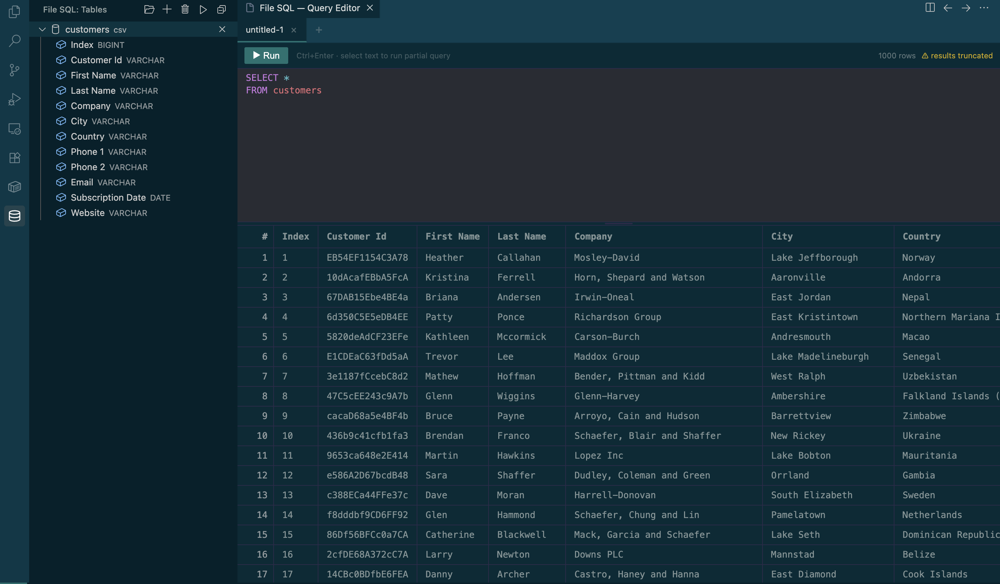

# File SQL — Query Local & S3 Files with SQL in VS Code

[](https://marketplace.visualstudio.com)
[](https://duckdb.org)
[](https://www.typescriptlang.org)
[](LICENSE)

> 🌐 **Landing page:** [arunkumar1997.github.io/vscode-sql-files](https://arunkumar1997.github.io/vscode-sql-files/) &middot; [Install on the Marketplace](https://marketplace.visualstudio.com/items?itemName=arunkumar1997.file-sql)

**File SQL** turns your local and Amazon S3 files into queryable SQL tables — right inside VS Code. Load CSV, JSON, Parquet, or plain-text files, and run SQL queries against them instantly using [DuckDB](https://duckdb.org)'s high-performance analytics engine. No databases, no ETL pipelines, no setup. Load CSV, JSON, Parquet, or plain-text files, and run SQL queries against them instantly using [DuckDB](https://duckdb.org)'s high-performance analytics engine. No databases, no ETL pipelines, no setup.



---

## ✨ Features

### 📂 Load Any Data Source

| Source                      | How                                                                                                                                             |
| --------------------------- | ----------------------------------------------------------------------------------------------------------------------------------------------- |
| **Local file**              | Enter a file path — CSV, JSON, Parquet, or text                                                                                                 |
| **Local folder**            | Pick a folder and register every supported file as a table                                                                                      |
| **S3 single file**          | Enter `s3://bucket/path/to/file.csv`                                                                                                            |
| **Hive-partitioned folder** | Enter `s3://bucket/path/to/folder/` — `key=value` partition folders are preserved and registered as **one table** with DuckDB Hive partitioning |

#### Folder → Table mapping

When you load a folder (local or S3), File SQL groups files by their **immediate parent directory**. Each leaf directory becomes one table named after that directory, and all files inside it are read together as a single dataset via DuckDB's glob syntax.

```
staging/
├── users/
│   ├── part-00001.parquet   ──┐
│   └── part-00002.parquet   ──┴──► table: users
├── product/
│   ├── part-00001.parquet   ──┐
│   └── part-00002.parquet   ──┴──► table: product
└── payment_data/
    └── part-00001.parquet   ──────► table: payment_data
```

For Hive-style datasets, the partitioned folder itself becomes one table. The `key=value` directories are preserved so DuckDB can read the data as a partitioned dataset.

```
sales/                       ──────► table: sales
├── region=us/
│   ├── date=2024-01-01/
│   │   └── part-00001.parquet
├── region=eu/
│   ├── date=2024-01-01/
│   │   └── part-00001.parquet
└── region=us/
    └── date=2024-02-01/
        └── part-00001.parquet
```

This works at any depth — only the **last subfolder** name is used as the table name for regular folders, while Hive-style partitions are kept together as a single table.

### 🔍 SQL Query Editor

- **CodeMirror 6** editor with SQL syntax highlighting and the **One Dark** theme
- **Autocomplete** for table names, column names, and SQL keywords
- **Run full query** — click ▶ Run or press `Ctrl+Enter`
- **Run selected text** — highlight a portion of SQL and press `Ctrl+Enter` to execute only that snippet
- **Multi-tab queries** — open multiple query tabs, rename them by double-clicking, and switch between them

### 📊 Results Grid

- Tabular results displayed directly below the editor
- Row count shown in the toolbar
- Truncation warning when results exceed the configured `maxResultRows` limit
- **Export CSV** and **Export Parquet** rerun the active query and write the full result, including rows beyond the visible limit
- Run custom DuckDB `COPY` or export statements directly in the editor for format-specific options; these statements are not limited by `maxResultRows`
- **Alt+Click** any header or cell to copy its value to the clipboard
- Complex column types (timestamps, structs, arrays, nested JSON) are displayed as readable strings instead of `[object Object]`

### 🗂️ Sidebar Explorer

- Helpful message shown when no tables are loaded so you always know what to do next
- Tree view listing configured and loaded tables, with expandable column details for loaded tables
- **Import Workspace Configuration** rereads `.filesql/config.json` and restores missing definitions as `Not loaded` without initializing DuckDB
- Use **Load** on an individual table only when you need to query it
- **Save Workspace Configuration** writes portable table definitions to `.filesql/config.json` and query tabs to `.filesql/queries/*.sql`
- **Right-click** a table to **Rename**, **Remove**, **Copy Table Name**
- **Right-click** a column to **Copy Column Name**
- S3-sourced tables show the original `s3://` URI as a tooltip

### 📐 Resizable Editor

- Drag the horizontal divider between the editor and results panel to resize
- Minimum height of 80 px, maximum stretches to fill the window

### ☁️ S3 Integration

- **Download-first architecture** — files are streamed from S3 to a local temp directory, then read by DuckDB (avoids httpfs redirect/auth issues)
- **Auto region detection** — bucket region is resolved via `GetBucketLocation`; the `fileSql.awsRegion` setting is only a fallback
- **AWS profile support** — reads credentials from `~/.aws/credentials` using the profile set in `fileSql.awsProfile`
- **Hive-style partitioned datasets** — folders with `key=value` subdirectories are registered as one table and read with DuckDB Hive partitioning support, preserving the partition layout for local folders and S3 downloads
- Temp files are cleaned up automatically when the extension deactivates

---

## 📦 Supported File Formats

| Extension                    | Detected As | DuckDB Expression                                          |
| ---------------------------- | ----------- | ---------------------------------------------------------- |
| `.csv`, `.tsv`               | CSV         | `read_csv('path', AUTO_DETECT=TRUE)`                       |
| `.json`, `.jsonl`, `.ndjson` | JSON        | `read_json_auto('path')`                                   |
| `.parquet`                   | Parquet     | `read_parquet('dir/*.parquet')`                            |
| `.txt`, `.log`               | Text        | `read_csv('path', DELIM='\n', COLUMNS={'line':'VARCHAR'})` |

---

## 🚀 Quick Start

### 1. Install

1. Open **VS Code** → **Extensions** (`Ctrl+Shift+X` / `Cmd+Shift+X`)
2. Search for **"File SQL"**
3. Click **Install**

**Requirements:** VS Code 1.85.0+

### 2. Load Data

**Option A — Explorer context menu:**
Right-click any `.csv`, `.parquet`, `.json`, etc. file in the Explorer → **Open with File SQL**

**Option B — Sidebar buttons:**
Open the **File SQL** sidebar (database icon in the Activity Bar), then:

- Click **＋** → enter a local path (`/data/sales.csv`) or S3 URI (`s3://bucket/prefix/`)
- Click **📁** → pick a local folder to import all supported files as tables
- Click the **save** button to persist the workspace tables and current query tabs
- Click **Import Workspace Configuration** to restore table definitions lazily and reopen saved query tabs
- Click **Load** on each table when you want DuckDB to materialize it

Saved queries are normal SQL files under `.filesql/queries/`, so they can be reviewed and shared with the rest of the workspace configuration.

### 3. Query

Write SQL in the editor and press **Ctrl+Enter**:

```sql
SELECT region, SUM(revenue) AS total_revenue
FROM sales
WHERE year >= 2024
GROUP BY region
ORDER BY total_revenue DESC;
```

Use **Export CSV** or **Export Parquet** in the toolbar to save the complete result. For custom DuckDB export options, run a `COPY` statement directly:

```sql
COPY (
    SELECT * FROM sales ORDER BY id
) TO '/data/sales-export.csv' (
    FORMAT CSV,
    HEADER true,
    DELIMITER '|',
    NULL 'N/A'
);
```

Custom `COPY` statements execute unchanged, so the file contains the full query result even when the results grid is capped by `fileSql.maxResultRows`.

---

## 💡 Tips

- **Filter early** — use `WHERE` to reduce the data DuckDB processes
- **Prefer Parquet** — columnar format is significantly faster than CSV for large datasets
- **Keep the grid responsive** — leave `fileSql.maxResultRows` bounded and use toolbar export or a custom `COPY` statement for complete output
- **Hive partitions stay together** — point to a Hive-style partitioned folder and File SQL registers it as one queryable table, preserving the partition hierarchy for DuckDB
- **Alt+Click cells** — quickly copy any value from the results grid

---

## 🔧 Troubleshooting

### Extension Not Activating

- Verify VS Code ≥ 1.85.0
- Reload the window: `Cmd+Shift+P` → **Developer: Reload Window**

### S3 Import Fails

- Confirm credentials: `aws sts get-caller-identity --profile your-profile`
- Check IAM permissions: `s3:GetObject`, `s3:ListBucket`, `s3:GetBucketLocation`
- Ensure the S3 path format is correct (`s3://bucket/key`)
- The region is auto-detected — the `fileSql.awsRegion` setting is a fallback only

---

## 🏗️ Development

```bash
# Clone the repository
git clone https://github.com/arunkumar1997/vscode-sql-files.git
cd vscode-sql-files

# Install dependencies
npm install

# Build (one-shot)
npm run build

# Watch mode (incremental rebuilds)
npm run watch

# Debug — press F5 in VS Code to launch Extension Development Host
```

### Build System

Two esbuild bundles are produced by `esbuild.mjs`:

| Bundle         | Entry                  | Output                                 | Platform                            |
| -------------- | ---------------------- | -------------------------------------- | ----------------------------------- |
| Extension host | `src/extension.ts`     | `dist/extension.js`                    | Node.js CJS (`duckdb` externalized) |
| Webview        | `src/webview/main.tsx` | `dist/webview.js` + `dist/webview.css` | Browser IIFE                        |

### Testing

```bash
npm run test:unit         # Vitest unit tests
npm run test:integration  # Vitest integration tests (real DuckDB)
npm run test:e2e          # Full E2E in a real VS Code instance
npm test                  # All three
```

E2E tests require a display server. On CI or headless Linux use `xvfb-run -a npm run test:e2e`.

---

## 🗺️ Roadmap

- [x] Saved query persistence
- [ ] Query history persistence
- [ ] Data visualization (charts and graphs)
- [ ] Additional file formats (Excel, Avro, SQLite)

---

## 🙏 Acknowledgments

- [DuckDB](https://duckdb.org) — high-performance in-process SQL analytics engine
- [CodeMirror 6](https://codemirror.net) — extensible code editor component
- [AWS SDK for JavaScript v3](https://aws.amazon.com/sdk-for-javascript/) — S3 client and credential handling
- [VS Code Extension API](https://code.visualstudio.com/api) — extension platform

---

## 📄 License

MIT — see [LICENSE](LICENSE) for details.

---

## 📬 Feedback & Issues

- **Report bugs**: [GitHub Issues](https://github.com/arunkumar1997/vscode-sql-files/issues)
- **Request features**: [GitHub Discussions](https://github.com/arunkumar1997/vscode-sql-files/discussions)

**⭐ If File SQL saves you time, [star the repo](https://github.com/arunkumar1997/vscode-sql-files) — it helps others find it!**
